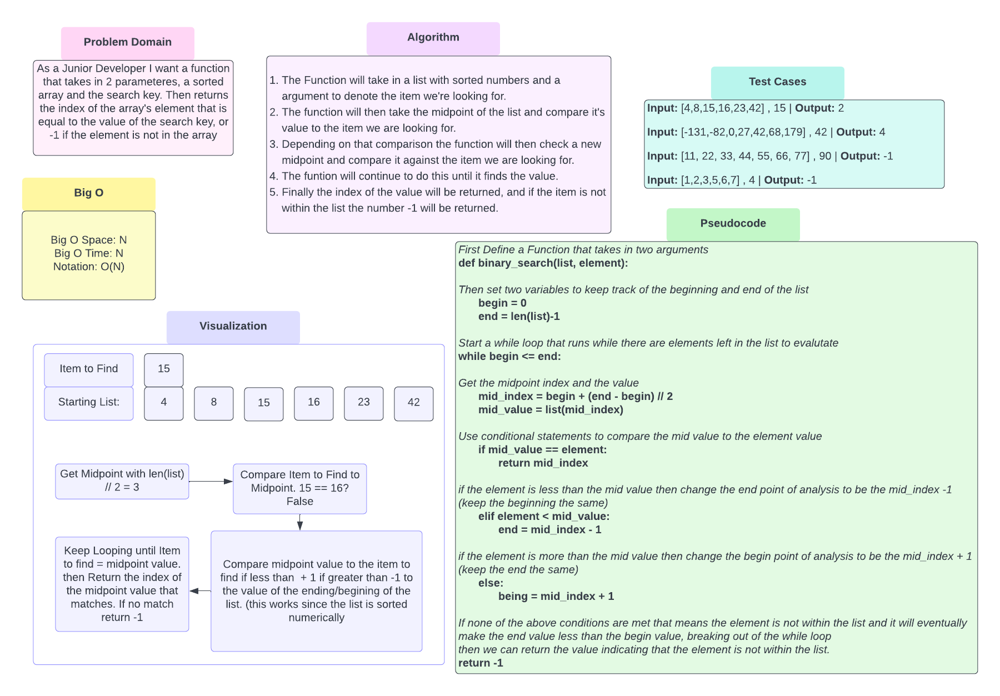

# Binary Search of Sorted Array
Write a function called BinarySearch which takes in 2 parameters:
a sorted array and the search key. Without utilizing any of the built-in methods available to your language,
return the index of the array’s element that is equal to the value of the search key,
or -1 if the element is not in the array.

## Collaboration
with Ella :)

## Whiteboard Process

## Approach & Efficiency
I took the approach of setting a range between the beginning and end of my list
then finding the midpoint of that list
then comparing the value at that midpoint to value in question
depending on the comparsion results I then adjusted the beginning(or end) of the range
and re-ran the comparison until the answer was found(or not found)

I think this would fall under Big O notation of O(N) still.
I gotta be honest, still don't really understand Big O
