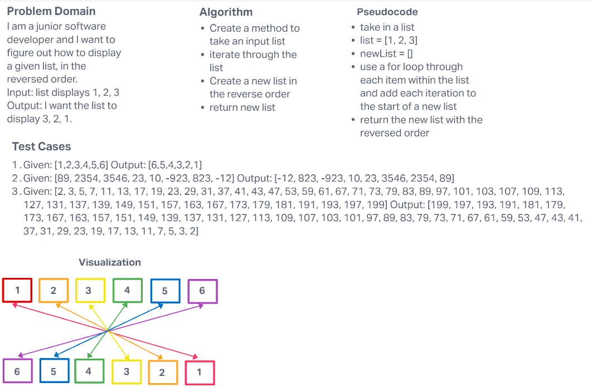

# Reverse an Array

Take an Array and Return the Array in the Reversed Order

## Whiteboard Process

## Approach & Efficiency
I took the approach of using a For Loop and iterating through the original array, adding each iteration to the start of a new array.

So for the List [1,2,3] the loop would start at index 0(1) and then add it to the newList [1].
Next iteration would hit 1(2) and add to the front of the newList with to_insert so the newList would not display [2, 1] etc for the length of the list.
This would be O(N) in big O notation because it's adding to the front of the list.
O(N) is kind of efficient but not as efficient as O(1) adding to the end of a list.

