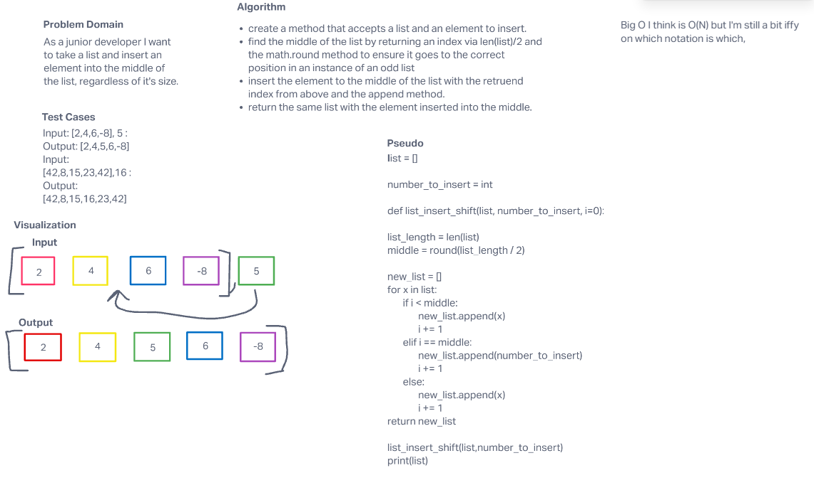

# Insert to Middle of an Array
Write a second function that removes an element from the middle index and shifts other elements in the array to fill the new gap.

## Whiteboard Process

## Approach & Efficiency
I took the approach of taking the length of the list, and dividing it by 2 (then rounding the number up to account for floats)
Then I took that number and compared each elements index against the number, if less than the middle number keep the index the same.
if the index is equal to the middle number, insert the new number intended for insertion.
if index greater than the middle index shift one over to the right.
I was not sure on which big O notation this was, though I was thinking it was potentially O(N).
