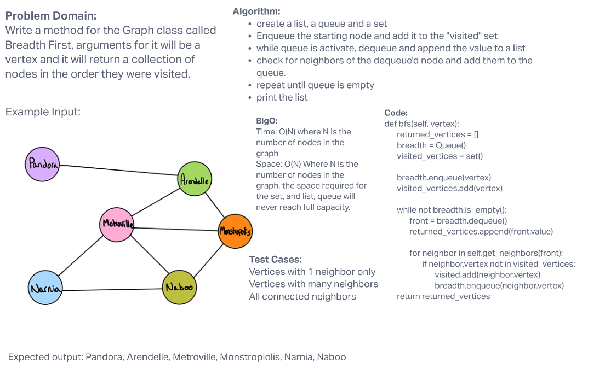

# Challenge Summary
<!-- Description of the challenge -->
Write a method for the Graph class that traverses breadth first and returns a collection of nodes in the order they were visited.

## Whiteboard Process
<!-- Embedded whiteboard image -->

## Approach & Efficiency
<!-- What approach did you take? Why? What is the Big O space/time for this approach? -->
Big O Time: O(N) where N is the number of items in the graph
Big O Space: O(N) where N is the number of values appended to the list

## Solution
<!-- Show how to run your code, and examples of it in action -->
- create a list to return, a set to denote visited, a queue to traverse.
- while queue is active, dequeue and append that value to the list to return, check for neighbors of that vertex and add them to the queue.
- repeat until queue is empty

[Code Solution](../../data_structures/graph.py)
