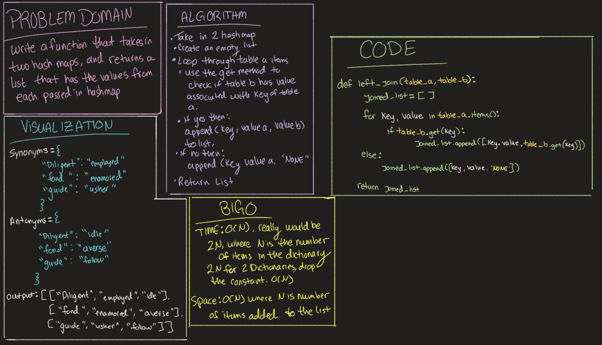

# Challenge Summary
<!-- Description of the challenge -->
Write a function that takes in two hashmaps and returns a list that has the values from each passed in hashmap. 

## Whiteboard Process
<!-- Embedded whiteboard image -->

## Approach & Efficiency
<!-- What approach did you take? Why? What is the Big O space/time for this approach? -->
Big O Time: O(N) where N is the number of items in the hashmap
Big O Space: O(N) where N is the number of values appended to the list

## Solution
<!-- Show how to run your code, and examples of it in action -->
* Take in 2 hashmaps
* Create an empty list
* Loop through table_a items
  * use the get method from the hashtable data structure to check if table_b has a value that is associated with table_a's key
    * if yes then append(key, value_a, and value_b)
    * if no then append(key, value_a, and 'NONE')
* return list that was appended to!

[Code Solution](../../code_challenge/hashtable_left_join.py)

