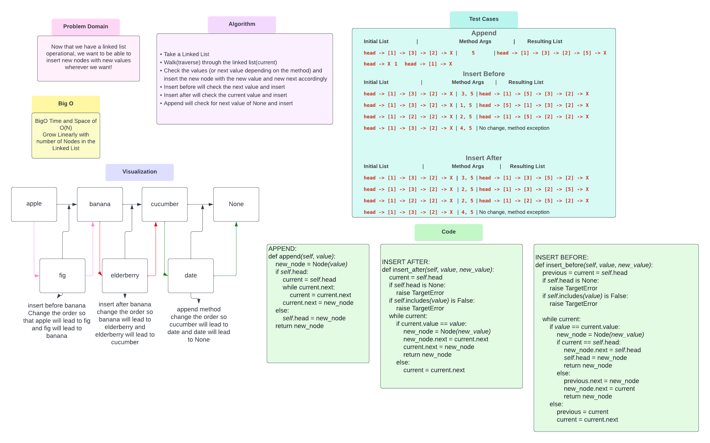

# Linked List Insertions
### Challenge Summary
Now that we have a linked list that allows for searching of includes and insertions.
We now want to append, insert before values and insert after values

### Whiteboard Process
<!-- Embedded whiteboard image -->

### Approach & Efficiency
<!-- What approach did you take? Why? What is the Big O space/time for this approach? -->
Create a method for append: add a new node with a given value to the end of a list
Create a method for insert before: which adds a new node with the given value before the node with a given value
Create a method for insert after: which adds a new node with the given value after the node with the given value
I think these are a BigO of a O(N) because the time/space should scale linearly with the amount of nodes within the linked list.

### Solution
<!-- Show how to run your code, and examples of it in action -->
* If Method for append is used the method will traverse through the linked list and append where the next value is "None"
  * I.E The end of the list
* If the method for insert before is used the method will traverse through the linked list checking the "next" value of each node then insert there
* If the method for insert before is used the method will traverse through the linked list checking each value for the correct node and insert there
[Code Solution](../../data_structures/linked_list.py)
