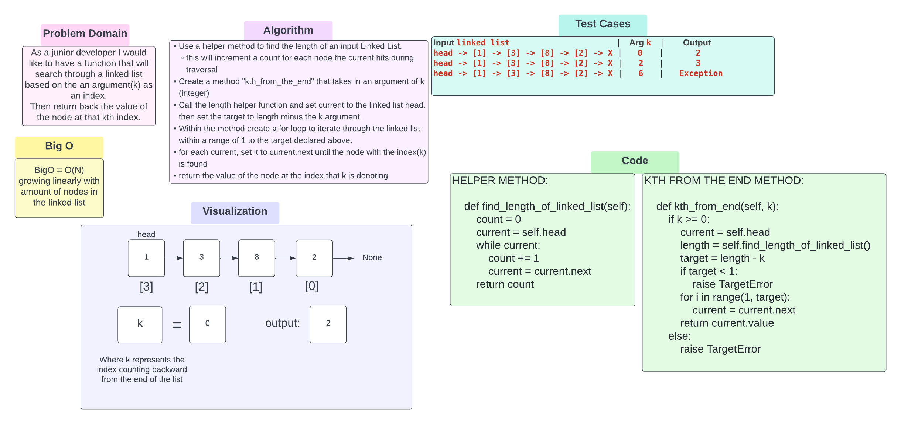

# kth from the end
### Challenge Summary
Create a method that given an argument k(as an index) will traverse through the linked list
return the value of the node at that kth index.

### Whiteboard Process
<!-- Embedded whiteboard image -->

### Approach & Efficiency
<!-- What approach did you take? Why? What is the Big O space/time for this approach? -->
I think these are a BigO of a O(N) because the time/space should scale linearly with the amount of nodes within the linked list.

### Solution
<!-- Show how to run your code, and examples of it in action -->
* Created a helper method to get the length of a linked list and then use that helper method in the kth from the end method
* Create a method called kth from the end and use it to traverse through a linked list and grab the value from the node
at the index of k (from the end)
[Code Solution](../../data_structures/linked_list.py)
