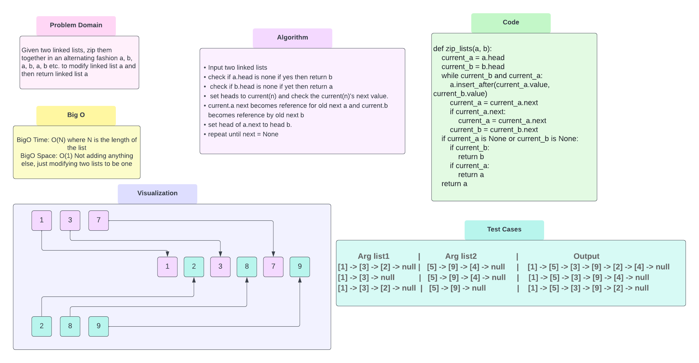

# Zip a Linked List
### Challenge Summary
Given two linked lists, zip them together in an alternating fashion a, b, a, b, a, b etc.
to modify linked list a and then return linked list a

### Whiteboard Process
<!-- Embedded whiteboard image -->

### Approach & Efficiency
<!-- What approach did you take? Why? What is the Big O space/time for this approach? -->
BigO Time: O(N) where N is the length of the list
BigO Space: O(1) Not adding anything else, just modifying two lists to be one

### Solution
<!-- Show how to run your code, and examples of it in action -->
* Input two linked lists
* check if a.head is none if yes then return b
* check if b.head is none if yet then return a
* set heads to current(n) and check the current(n)'s next value.
* current.a next becomes reference for old next a and current.b becomes reference by old next b
* set head of a.next to head b.
* repeat until next = None
[Code Solution](../../code_challenges/linked_list_zip.py)
