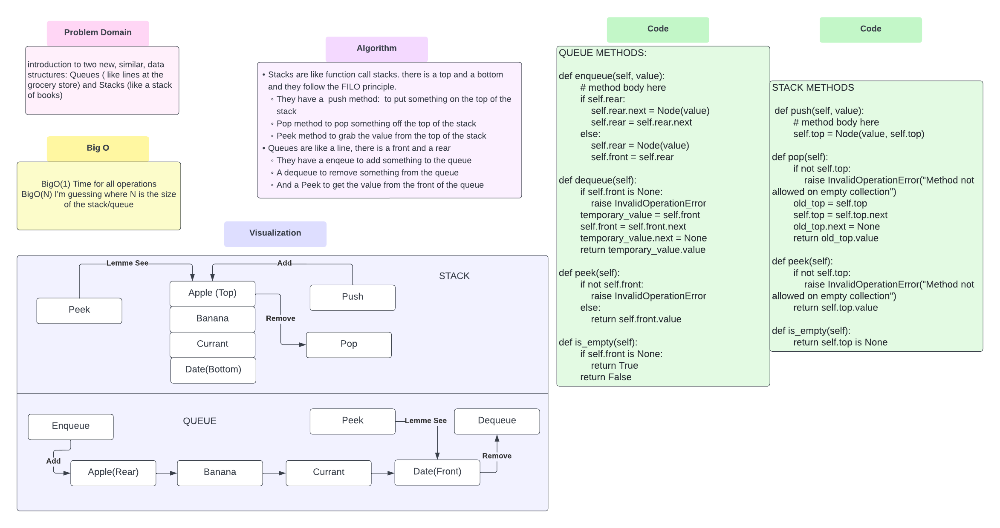

# Stacks and Queues
<!-- Short summary or background information -->
Stacks in programming are like stacks in real life, like a stack of books
Queues in programming are also like queues in real life, like at a grocery store

## Challenge
<!-- Description of the challenge -->
Introduction to the data structures of stacks and queues.

## Approach & Efficiency
<!-- What approach did you take? Why? What is the Big O space/time for this approach? -->
BigO(1) for Time
BigO(N) for space where N is amount of things in the stack/queue

## API
<!-- Description of each method publicly available to your Stack and Queue-->
Stacks:
Push: add a node to the top
Pop: Remove a node from the top
Peek: Grab value of top node
IsEmpty: Check if stack is empty

Queue:
Enqueue: adds a node to the rear
Dequeue: takes a node from the front
Peek: takes the value from the front
IsEmpty: check if the queue is empty

## Whiteboard

