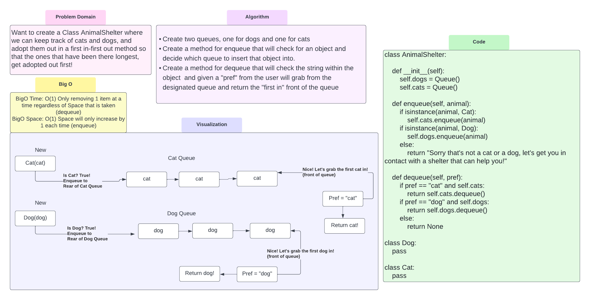

# Challenge Summary
<!-- Description of the challenge -->
Create a class called AnimalShelter which holds only dogs and cats.
The shelter operates using a first-in, first-out approach.
If the pup or kitty have been there the longest they deserve to be adopted!
So let's put them in a queue which uses a FIFO approach!

## Whiteboard Process
<!-- Embedded whiteboard image -->

## Approach & Efficiency
<!-- What approach did you take? Why? What is the Big O space/time for this approach? -->
BigO Time: O(1) Only removing 1 item at a time regardless of Space that is taken (dequeue)
BigO Space: O(1) Space will only increase by 1 each time (enqueue)
Method: Enqueue adds objects to the queue
Method: Dequeue takes first in object out of the queue and returns it  .

## Solution
<!-- Show how to run your code, and examples of it in action -->
Input object instance of Cat or Dog in the enqueue
input string of cat or dog to dequeue the first in object of the queue!
Simple and clean
[Code Solution](../../code_challenges/stack_queue_animal_shelter.py)
