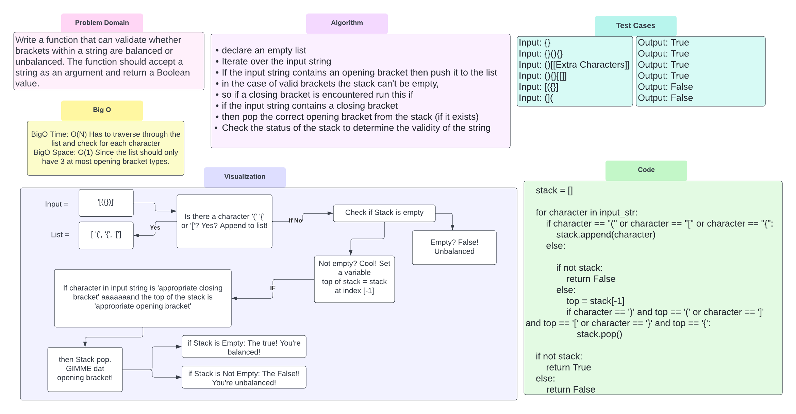

# Challenge Summary
<!-- Description of the challenge -->
Write a function that can validate whether brackets within a string are balanced or unbalanced.
The function should accept a string as an argument and return a Boolean value.

## Whiteboard Process
<!-- Embedded whiteboard image -->

## Approach & Efficiency
<!-- What approach did you take? Why? What is the Big O space/time for this approach? -->
BigO Time: O(N) Has to traverse through the list and check for each character
BigO Space: O(1) Since the list should only have 3 at most opening bracket types.

## Solution
<!-- Show how to run your code, and examples of it in action -->
* declare an empty list
* Iterate over the input string
* If the input string contains an opening bracket then push it to the list
* in the case of valid brackets the stack can't be empty,
* so if a closing bracket is encountered run this if
* if the input string contains a closing bracket
* then pop the correct opening bracket from the stack (if it exists)
* Check the status of the stack to determine the validity of the string

[Code Solution](../../code_challenges/stack_queue_brackets.py)
