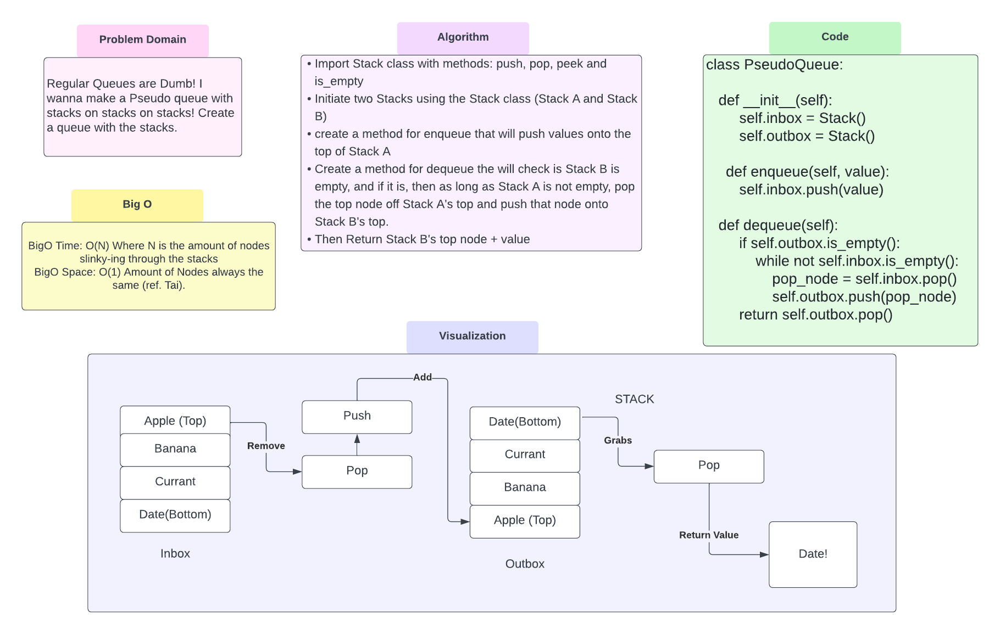

# Challenge Summary
<!-- Description of the challenge -->
Create a new class called pseudo queue
Do not use an existing Queue.
Instead, this PseudoQueue class will implement our standard queue interface (the two methods listed below)
Internally, utilize 2 Stack instances to create and manage the queue

## Whiteboard Process
<!-- Embedded whiteboard image -->

## Approach & Efficiency
<!-- What approach did you take? Why? What is the Big O space/time for this approach? -->
Import Stack class with methods: push, pop, peek and is_empty
Initiate two Stacks using the Stack class (Stack A and Stack B)
create a method for enqueue that will push values onto the top of Stack A
Create a method for dequeue that will check is Stack B is empty, and if it is, then as long as Stack A is not empty, pop the top node off Stack A's top and push that node onto Stack B's top.
Then Return Stack B's top node + value

## Solution
<!-- Show how to run your code, and examples of it in action -->
Check is Stack B is Empty: if yes then move stuff from Stack A to Stack B until stack A is empty
[Code Solution](../../code_challenges/stack_queue_pseudo.py)
