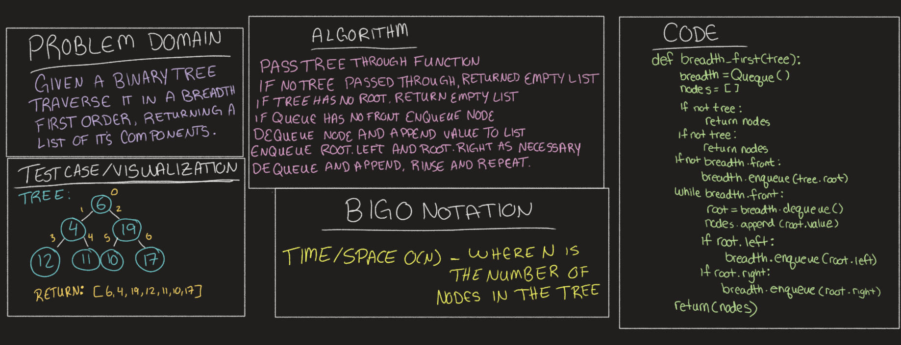

# Challenge Summary
<!-- Description of the challenge -->
Given a Binary tree, traverse the tree in a breadth first order, returning a list of the tree's components. 

## Whiteboard Process
<!-- Embedded whiteboard image -->

## Approach & Efficiency
<!-- What approach did you take? Why? What is the Big O space/time for this approach? -->
BigO for time and space should both be O(N)
where N is the number of nodes in the tree

## Solution
<!-- Show how to run your code, and examples of it in action -->
Function works by passing in a tree as an argument, then traversing through tree dequeuing and appending to a list while enqueueing left and right nodes, then repeat the process until fully traverse.
[Code Solutions](../../code_challenges/tree_breadth_first.py)
