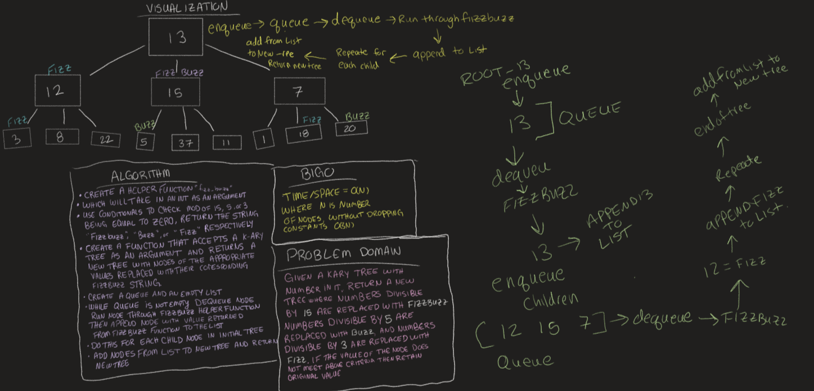

# Challenge Summary
<!-- Description of the challenge -->
Write a function called fizz buzz tree with the argument of a k-ary tree that returns a new k-ary tree

## Whiteboard Process
<!-- Embedded whiteboard image -->

## Approach & Efficiency
<!-- What approach did you take? Why? What is the Big O space/time for this approach? -->
BigO for time and space should both be O(N)
where N is the number of nodes in the tree. I think because I also used a queue and a second tree it may be Big O(3N) but you drop the constants

## Solution
<!-- Show how to run your code, and examples of it in action -->
* Create a helper function "fizzbuzz"
* which will take in an int as an argument
use conditionals to check mod of 15, 5 and 3 being equal to 0
* return the string fizzbuzz buzz or fizz respectively
* create a function that accepts a k-ary tree as an argument and returns a new tree with nodes of the appropriate value replaced with their corresponding fizz-buzz string.
* create a queue and an empty list
* enqueue root.
* while queue is not empty dequeue node then run node through fizzbuzz helper function
* append node with value returned from fizz buzz function to the list
* do this for each child node in initial tree
* add nodes from list to new tree and return new tree!

I didn't do any code because JB said to just draw it out and that would be good enough :D
