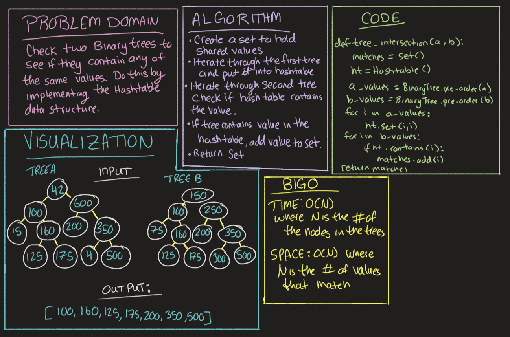

# Challenge Summary
<!-- Description of the challenge -->
Find all the values that match within two given Binary Trees. Use a hashtable in order to execute this.

## Collaboration

Worked with Benjamin Carter

## Whiteboard Process
<!-- Embedded whiteboard image -->

## Approach & Efficiency
<!-- What approach did you take? Why? What is the Big O space/time for this approach? -->
Big O Time: O(N) where N is the number of nodes within the tree.
Big O Space: O(N) where N is the number of values that match within the two trees.

## Solution
<!-- Show how to run your code, and examples of it in action -->
* Create a set to hold shared values
* Iterate through the first tree and put values into a hashtable
* iterate through the second tree and compare values to hashtable using the contains method
* if value is in hashtable then put value into set
* return set

[Code Solution](../../code_challenge/tree_intersection.py)

