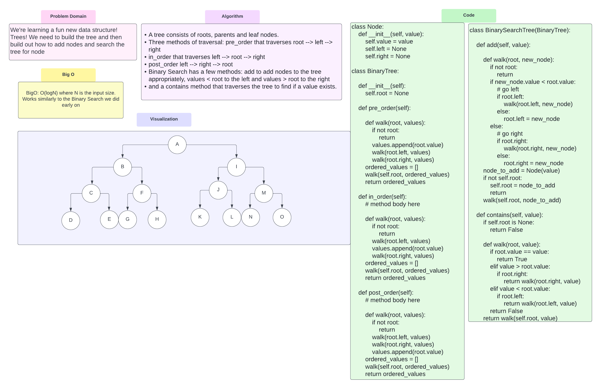

# Trees
<!-- Short summary or background information -->
A tree is a nonlinear data structure that consists of nodes connected by edges.

## Challenge
<!-- Description of the challenge -->
Introduction to new Data structure! Challenge is to build a tree with three traversal methods
pre_order , in_order, post_order.
And methods to add a node to the tree, and check if there is a node with a value in a tree.

## Approach & Efficiency
<!-- What approach did you take? Why? What is the Big O space/time for this approach? -->
BigO: O(logN) where N is the input size. Works similarly to the Binary Search we did early on

## API
<!-- Description of each method publicly available in each of your trees -->

A tree consists of roots, parents and leaf nodes.
Three methods of traversal: pre_order that traverses root --> left --> right
in_order that traverses left --> root --> right
post_order left --> right --> root
Binary Search has a few methods: add to add nodes to the tree appropriately, values < root to the left and values > root to the right
and a contains method that traverses the tree to find if a value exists.
