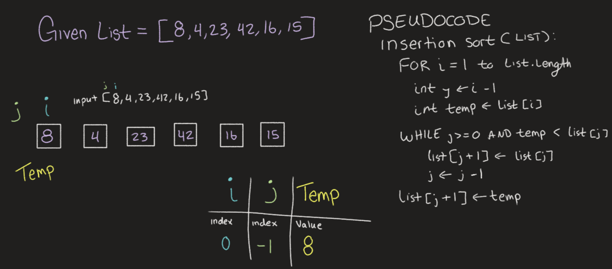
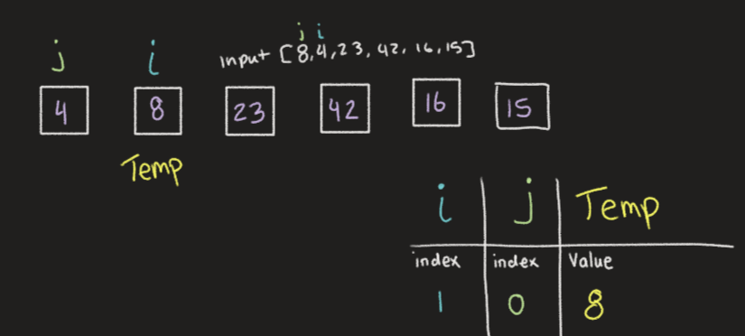
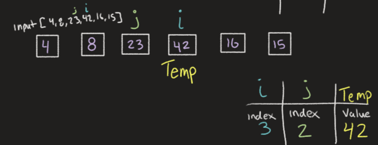
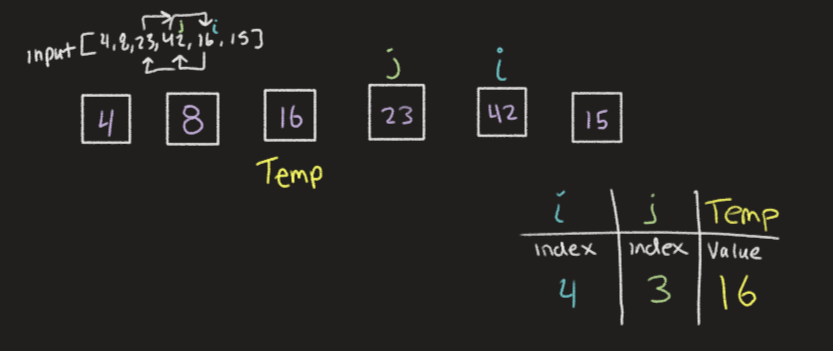
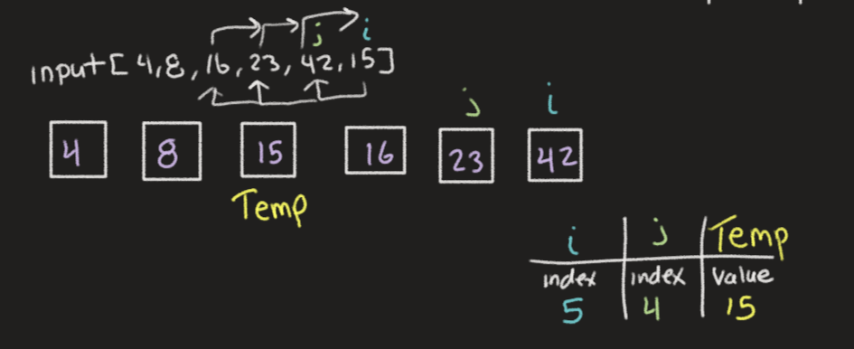

# Blog Notes: Insertion Sort

## Hello and welcome to the Insertion Sort Algorithmic Blog.

As a human we sort just with our brains and eyes, but a computer, doesn't have eyes, and it's brain will only do what we tell it to do!

For a computer to sort we need to tell it, step by step, how we want the items in a list to be sorted.
Let's hop right in and look at an example of Insertion sorting!
___

### How Does it Work

* We look at the list by one element at a time. Meaning that for the first run-through, your list is already sorted! We don't have to do much here, just move onto the next pass through.
* Select the following element and compare it to each of the values that preceded it, comparing the values of the elements.
* If the element's value is larger then we will swamp the positions of the element in question, with the element we're comparing it to, the ol' switcheroo.
* When we get to the start of the list, or the number before it is no longer larger than it, we'll move onto the next element.
* Continue this line of logic until the end!

___

### Let's Peek at the Code itself

```python
def insertion_sort(list): # pass the list in question into the function, to be sorted
  for i in range(len(list)): # run through this loop until there are no more items in the list
    j = i -1 # set a second variable for comparison of the first element (i)
    temp = list[i] # set a temp value that will remain the same throughout this iteration of the loop

    while j >= 0 and temp < list[j]: # if j is greater than or equal to 0 (meaning i is >= 1) AND the temp (value of the list at index i) is LESS THAN the value of the list at index j, then run this loop!
      list[j+1] = list[j] # set value of the element at index j +1 to be the value of the element at index j (This is the ol' switcheroo we mentioned)
      j -= 1 # decrement J, this will either compare our temp to the next element, or it will break us out of the while loop

    list[j+1] = temp # since we may have changed the value of this index position, we want to do a reset to the last element we were comparing (which is temp!) setting us up to go to the next iteration of the for loop

  return list # once both loops are done, the values should be sorted and we can return the fully sorted list.
```
Now that you've seen the code and a little explanation, lets do a visual walk through.
___

## Welcome to the Visualization

First lets input the list!

In this first iteration we're going to set i to be (8) and j to be nothing, this loop doesn't do too much, since J is not greater than or equal to (0). We just set our temp value to (8) and move on to the next iteration.
___

In the above iteration i is set to index (1) with a value of (4) and j is set to the index (0) with a value of 8 as seen by the "input" list.
The temp value is set to the value (4). Compare temp to the value of J(8) and find that it's less than, so the while loop is hit, and the two values do the ol' switcheroo. Visualized by the values in the boxes. Then we continue onto the next iteration.
___

In the above iteration i is set to index (2) with a value of (23) and j is set to the index (1) which is the value of (8), as seen by the "input" list.
The temp value is set to the value (23) and is then compared to the value (8), since (23) is greater than (8) the while loop is not hit and we move onto the next iteration.
___

In the above iteration i is set to the index (3) with a value of (42) and j is set to the index (2) with the value of (23), as seen by the "input" list.
The temp value is set to the value of (42) and is then compared to the value of (23), since (42) is greater than (23), the while loop is not hit and we move onto the next iteration.
___

In the above iteration i is set to the index (4) with the value of (16) and j is set to the index (3) which is the value of (42) as seen by the "input" list.
The temp value is set to the value of (16) and is compared to the value of (42), since (16) is smaller than (42) they do the switcheroo and j is decremented to the next value (23), the temp value(16) is then compared to the next value (23), since 16 is less than (23) we do another switcheroo. J decrements again and we compare (16) to the next value (8). Since (8) is less than (16), we break out of the while loop and continue onto the next iteration of the for loop.
___

In the above iteration i is set to the index (5) with the value of (15) and j is set to the index (4) which is the value of (42) as seen by the "input" list.
The temp value is set to the value of (15) and is compared to the value of (42), since (15) is smaller than (42) they do the switcheroo and j is decremented to the next value (23), the temp value(15) is then compared to the next value (23), since (15) is less than (23) we do another switcheroo. J decrements again and we compare (15) to the next value (16). Since (15) is less than (16) we do another switcheroo. J decrements again and we compare (15) to the next value (8) Since 15 is greater than (8), we break out of the while loop and continue onto the next iteration of the for loop.
___

## Big O Analysis

Time: O(n^2): When you add an item to the list, it's going to increase the time exponentially. Since you're checking every number before it (potentially, worst case scenario) So a list of 5 numbers you'll go through 1+2+3+4+5 = 15, but if you have a list of 10 numbers you'll go through 1+2+3+4+5+6+7+8+9+10 = 55. That's a pretty big jump for just 5 extra numbers!

Space: O(N) where N is the number of items added to the list.
___

### Summary

And that's it!
Something so simple for our brains is actually pretty complex to program out on a computer!
Hope my explanation made sense and helped make things easier for you!

Bye!
