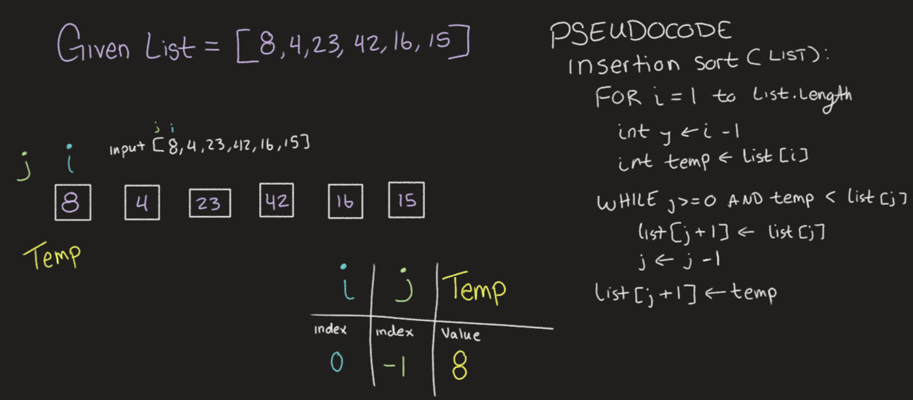
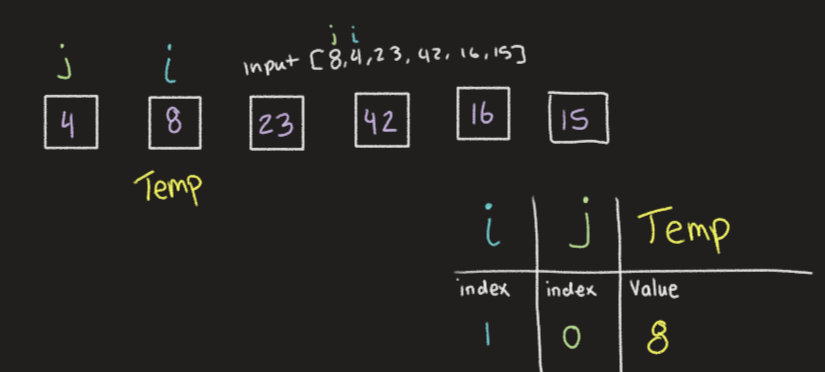
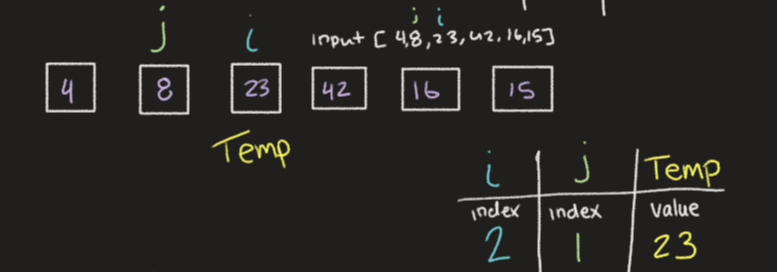
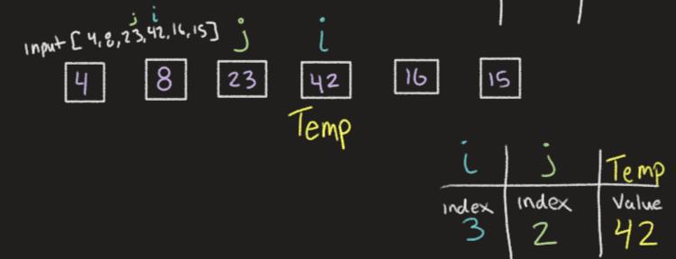
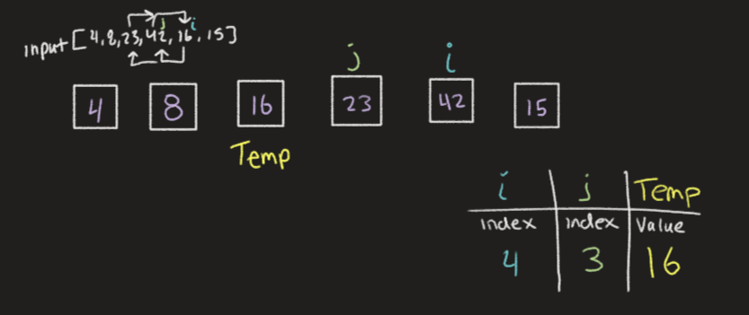
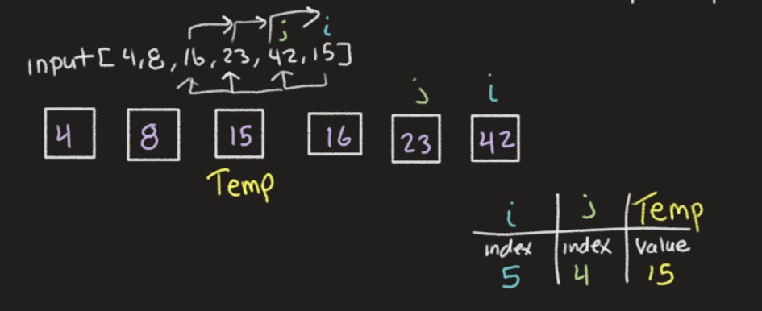

# Blog Notes: Insertion Sort

## Hello and welcome to the Insertion Sort Algorithmic Blog.

As a human we sort just with our brains and eyes, but a computer, doesn't have eyes, and it's brain will only do what we tell it to do!

For a computer to sort we need to tell it, step by step, how we want the items in a list to be sorted.
Let's hop right in and look at an example of Insertion sorting!
___

### How Does it Work

* We look at the list by one element at a time. Meaning that for the first run-through, your list is already sorted! We don't have to do much here, just move onto the next pass through.
* Select the following element and compare it to each of the values that preceded it, comparing the values of the elements.
* If the element's value is larger then we will swamp the positions of the element in question, with the element we're comparing it to, the ol' switcheroo.
* When we get to the start of the list, or the number before it is no longer larger than it, we'll move onto the next element.
* Continue this line of logic until the end!

___

### Let's Peek at the Code itself

```python
def insertion_sort(list): # pass the list in question into the function, to be sorted
  for i in range(len(list)): # run through this loop until there are no more items in the list
    j = i -1 # set a second variable for comparison of the first element (i)
    temp = list[i] # set a temp value that will remain the same throughout this iteration of the loop

    while j >= 0 and temp < list[j]: # if j is greater than or equal to 0 (meaning i is >= 1) AND the temp (value of the list at index i) is LESS THAN the value of the list at index j, then run this loop!
      list[j+1] = list[j] # set value of the element at index j +1 to be the value of the element at index j (This is the ol' switcheroo we mentioned)
      j -= 1 # decrement J, this will either compare our temp to the next element, or it will break us out of the while loop

    list[j+1] = temp # since we may have changed the value of this index position, we want to do a reset to the last element we were comparing (which is temp!) setting us up to go to the next iteration of the for loop

  return list # once both loops are done, the values should be sorted and we can return the fully sorted list.
```
Now that you've seen the code and a little explanation, lets do a visual walk through.
___

## Welcome to the Visualization

First lets input the list!

In this first iteration we're going to set i to be 8 and j to be nothing, this loop doesn't do too much, since J is not greater than or equal to 0. We just set our temp value to 8 and move on to the next iteration.
___

In this iteration i is set to index (1) with a value of 8 and j is set to the index (0) with a value of 4.
The temp value is set to the value 8 




