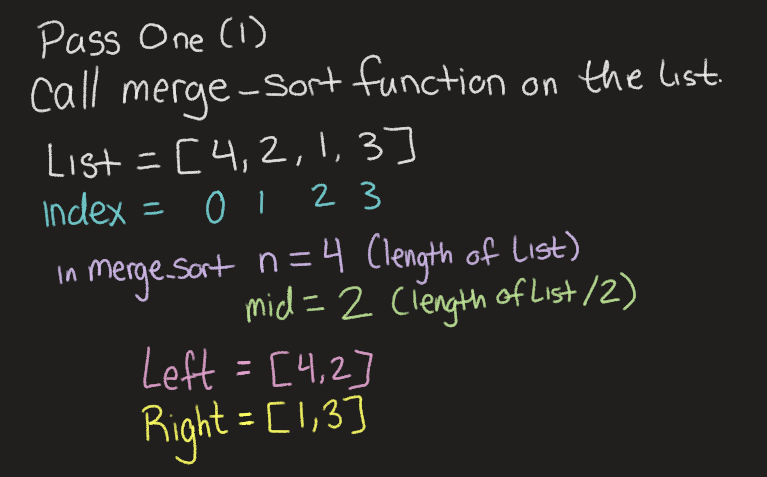
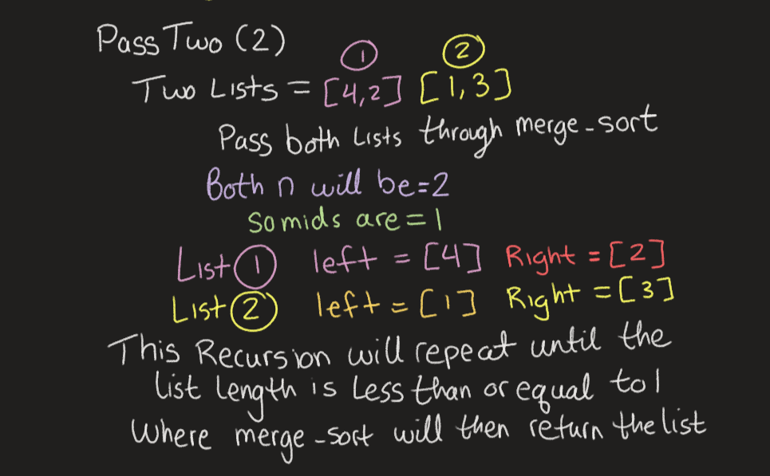
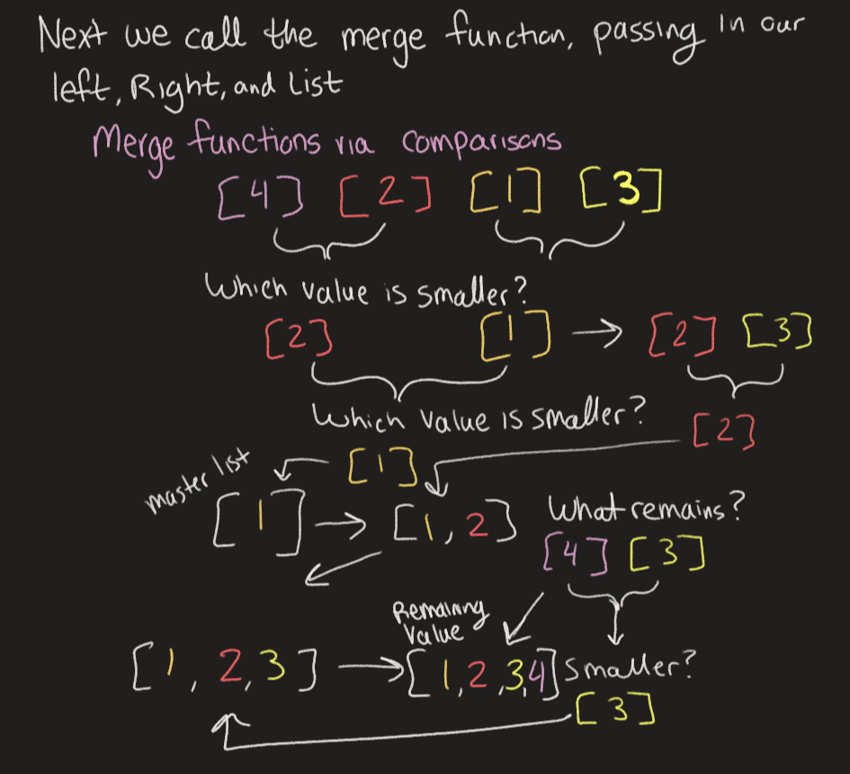

# Blog: Merge Sort

Merge Sorting is a method of divide and conquer, to approach the problem you break down a list in to teeny tiny parts before building it back up again.

___

## How does it work?

___

1. Input a list, and divide that list at it's midpoint
2. Separate it into left and right lists
3. Repeat the process until you have only one number in each list.
4. merge the individual numbers back together using comparison operators to sort how you desire! (For us that's going to be in ascending order)

___

## Code Example

```python
def merge_sort(lst):
    n = len(lst) # n will be the length of the list
    if n > 1: # This if statement will run so long as the list is greater than 1 in length
        mid = n // 2 # to find the midpoint we divide the length of the list in half giving us a way to divide the given
        left = lst[:mid] # assign the value left to the left half of the list dividing at the mid point
        right = lst[mid:] # assign the value right to the right half of the list dividing at the mid point
        merge_sort(left) # run merge sort on the left list dividing it further
        merge_sort(right) # run merge sort on the right list dividing it further
        merge(left, right, lst) # run the zipper method within merge on the left, the right, and a list
    return lst # return the list!


def merge(left, right, lst):
    i = j = k = 0 # set some variables to start at 0 as they'll be decremented accordingly to break us out of loops depending on lengths of the lists being passed into the function

    while i < len(left) and j < len(right): # this while loop will run as long as the length of left and length of right are greater than i and j (starting at 0 and incrementing up within the function)
        if left[i] <= right[j]: # conditional that will run so long as the value at left index i is less than or equal to the value at right index j
            lst[k] = left[i] # assign the k index of the main list to the left value at index i (the lesser of the two)
            i += 1 # increment i and run the if again if applicable
        else:
            lst[k] = right[j] # else, that means that the value in the right list is greater than the value in the left list, so assign the value at index k of the main list to the right value (the lesser of the two!)
            j += 1 # increment j and keep running the while/if/else statements
        k += 1 # increment k so that the place within the main list gets incremented with each looparound!

    if i == len(left): # once i is equal to the length of the left list (you've reached the end of the list)
        while j < len(right): # if there are still items in the right list
            lst[k] = right[j] # then assign those items to the main list
            j += 1 # increment right list position
            k += 1 # also increment the main list position
    else: # else you still have stuff to go through in the left list!
        while i < len(left): # while you still have items in the left list
            lst[k] = left[i] # assign those items to the main list
            i += 1 # increment the left list position
            k += 1 # increment the right list position
```
___
## Let's get an Visualization!

* We're gonna call the merge_sort function on our un-ordered list, and it will split that list down the middle and recursively sort both halves.

___

* The recursion is repeated until base case (length is less than 1) is hit and you're left with lists of length 1 (already sorted!)

___

* Merge is now used to zipper together the already sorted sub-lists, allowing for the conditionals we placed to maintain the order! Returning the final, sorted list.

___

## Big O Analysis

Time: O(log(n)): Because the function itself gets larger, it will take more time, but it's not exactly linear. The recursion and it being split up consistently down to one is O(log(n)), the time it takes to put it together is linear, O(n), so O(log(n))+n where you drop the constant becomes just O(log(n))

Space: O(n) where n is the amount of items in the list, being proportional to how many additional lists get made is linear.
___

## Summary

So there you have it! That's the end of the merge sorting function.
You take apart the list and then zipper it back together using a fancy array of conditional statements! Amazing how what our human brains can do automatically can be done in such a complex way! (And also in more than one way! See another way to achieve this same result here, using the [Insertion Sort Method](../insertion/BLOG.md))
I hope that cleared things up rather than mudding the pond even further! Let me know if you have any questions!

